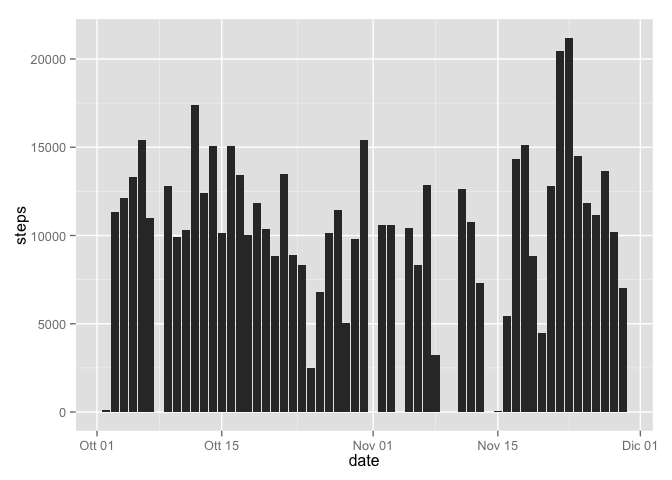
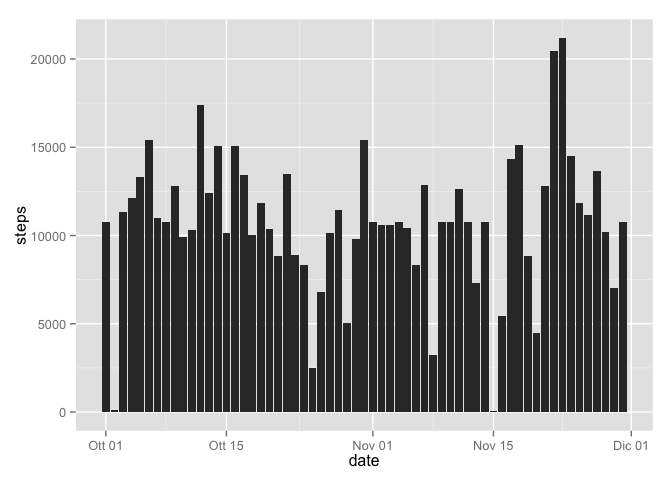
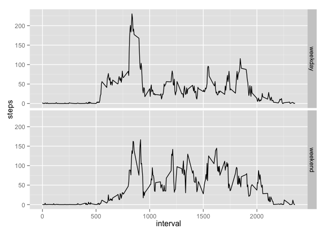

# Reproducible Research: Peer Assessment 1

We are assuming that _actitvity.csv_ is available in R working directory.

## Loading and preprocessing the data


```r
# Read the data and forma the column "date" as Date
tab1 <- read.csv("activity.csv")
tab1$date <- as.Date(tab1$date, "%Y-%m-%d")
```

## What is mean total number of steps taken per day?

- A histogram of the total number of steps taken each day


```r
# ignore NAs in tab2
tab2 <- na.omit(tab1)

# sum all values of steps, grouped by date
spd <- tapply(tab2$steps,tab2$date,sum)

# sum all values of steps, grouped by date, in a ggplot2 histogram
library(ggplot2)
qplot(date,steps, data=tab2, stat="summary", fun.y="sum", geom="bar")
```

 

- Mean and median number of steps taken each day


```r
# mean
mean(spd)
```

```
## [1] 10766.19
```

```r
#median
median(spd)
```

```
## [1] 10765
```


## What is the average daily activity pattern?

- Time series plot of the 5-minute interval (x-axis) and the average number of steps taken, averaged across all days (y-axis):


```r
qplot(interval,steps, data=tab2, stat="summary", fun.y="mean", geom="line")
```

 

- Which 5-minute interval, on average across all the days in the dataset, contains the maximum number of steps?


```r
# get the mean steps for each 5 minute interval
interval_mean <- tapply(tab2$steps,tab2$interval,mean)

# find which interval has by average the most steps
as.numeric(names(which.max(interval_mean)))
```

```
## [1] 835
```

## Imputing missing values

- Calculate and report the total number of missing values in the dataset

```r
# find how many NAs there are
sum(is.na(tab1$steps))
```

```
## [1] 2304
```

- Devise a strategy for filling in all of the missing values in the dataset The strategy consists of filling the missing values with the average of that 5-min interval.


```r
# let tab3 be a new tab1
tab3 <- tab1

# substitue NAs in tab3 with the means of the 5-minute intervals
for(i in 1:nrow(tab3)) {
  if(is.na(tab3$steps[i])){
    tab3$steps[i] <- interval_mean[[as.character(tab3$interval[i])]]
    }
  }
```

- Make a histogram of the total number of steps taken each day and calculate and report the mean and median total number of steps taken per day


```r
spd3 <- tapply(tab3$steps,tab3$date,sum)
qplot(date,steps, data=tab3, stat="summary", fun.y="sum", geom="bar")
```

 

```r
# mean
mean(spd3)
```

```
## [1] 10766.19
```

```r
#median
median(spd3)
```

```
## [1] 10766.19
```

Do these values differ from the estimates from the first part of the assignment? What is the impact of imputing missing data on the estimates of the total daily number of steps?


```r
# difference in mean between the two results
mean(spd3) - mean(spd)
```

```
## [1] 0
```

```r
# difference in median between the two results
median(spd3) - median(spd)
```

```
## [1] 1.188679
```

## Are there differences in activity patterns between weekdays and weekends?

- Create a new factor variable in the dataset with two levels – “weekday” and “weekend” indicating whether a given date is a weekday or weekend day.


```r
# let tab4 be a new tab3
tab4 <- tab3

# Set locale to English for months and days of the week
Sys.setlocale("LC_TIME", 'en_GB.UTF-8')
```

```
## [1] "en_GB.UTF-8"
```

```r
# create a day column in tab4 with the default value "weekday"
tab4$day <- "weekday"

# substitute "weekend" for "weekday" on saturday and sunday
for(i in 1:nrow(tab4)) {
  wd <- weekdays(tab4$date[i])
  if( wd == "Saturday" || wd == "Sunday" ){
    tab4$day[i] <- "weekend"
    }
  }
```

- Make a panel plot containing a time series plot (i.e. 𝚝𝚢𝚙𝚎 = "𝚕") of the 5-minute interval (x-axis) and the average number of steps taken, averaged across all weekday days or weekend days (y-axis).


```r
qplot(interval,steps, data=tab4, stat="summary", fun.y="mean", geom="line",facets=day ~ .)
```

 
